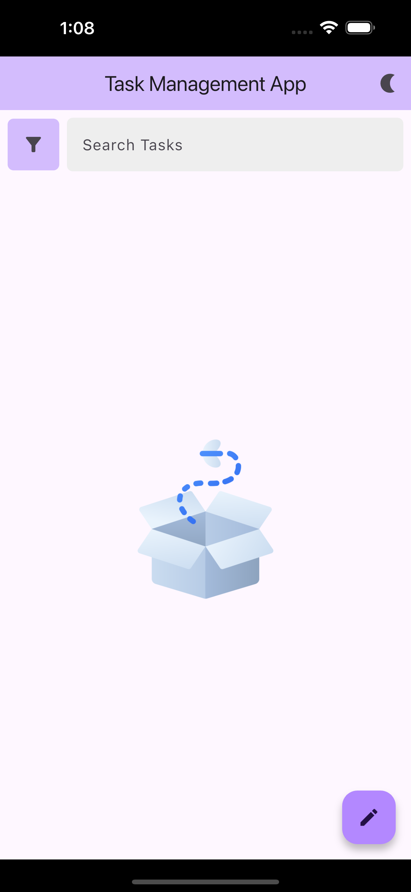

# Task Management App

Flutter Task Management App

## Getting Started

clone the repository and run the following command to get the required packages

```bash
flutter pub get
```

to run the app use the following command

```bash
flutter run
```

<div style="display: flex; overflow-x: auto; gap: 10px;">

  
  
  
  
  
  

</div>


